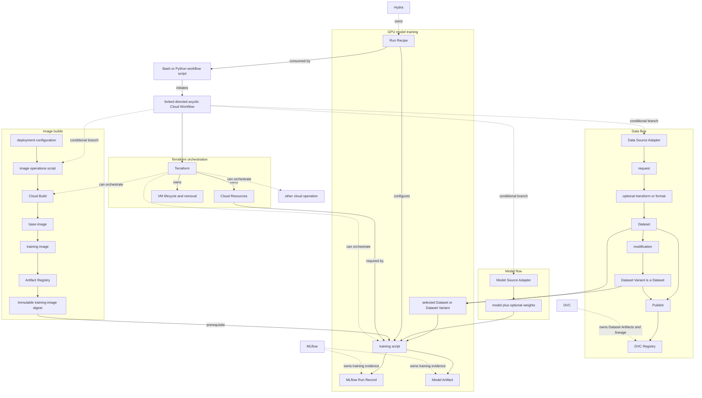

# Program Flow

## Cloud Flows

Terraform can orchestrate any operation performed in the cloud, whether or not
it includes GPU model training. GPU model training requires
Terraform-provisioned Cloud Resources, but it does not define Terraform's
orchestration behavior. The training script trains the selected model on the
selected Dataset; MLflow does not receive raw Dataset directories.

[Cloud Operations](cloudops.md) · [Terraform](terraform.md) ·
[Configuration](configuration.md) · [Training guide](../guide/training.rst)
