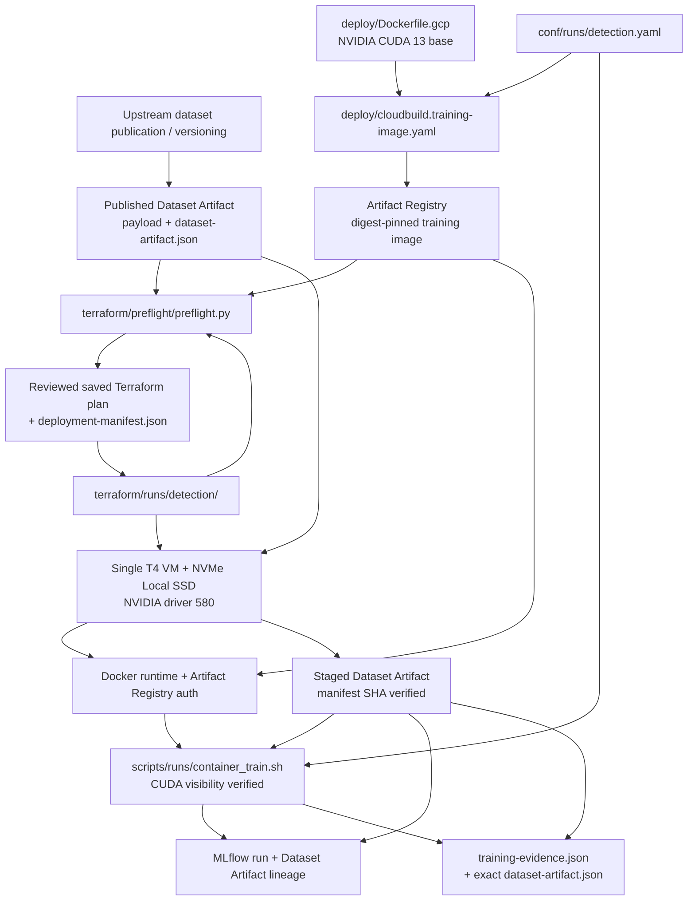

# Program Flow

## Training deployment

Dataset versioning is upstream of GPU training. DVC may participate in the
publication workflow, but the GPU VM consumes the already-published Dataset
Artifact. The GPU runtime does not run DVC or generate a replacement lockfile.
`dataset-artifact.json` is the provenance contract across the seam.

The training image has one build path: `deploy/Dockerfile.gcp` through
`deploy/cloudbuild.training-image.yaml`. The digest-pinned NVIDIA CUDA 13 base
matches the CUDA major used by the locked PyTorch runtime; PyTorch supplies its
own locked CUDA/cuDNN user-space dependencies. There is no intermediate Feral
Vision base image and no run-specific training image.

Terraform owns the disposable VM lifecycle. Preflight validates the exact
saved plan and records its SHA-256 together with the training-image digest and
Dataset Artifact manifest SHA-256. `scripts/runs/detection.sh` applies only that
reviewed plan and waits for terminal training evidence.

After VM creation, startup proves host Docker/NVIDIA tooling, configures Docker
for Artifact Registry using the VM identity, pulls the exact digest, verifies
the Dataset Artifact, and confirms CUDA from inside the real training image.
VM creation or RUNNING status is not training success.

[Cloud Operations](cloudops.md) · [Terraform](terraform.md) ·
[Configuration](configuration.md) · [Training guide](../guide/training.rst)
